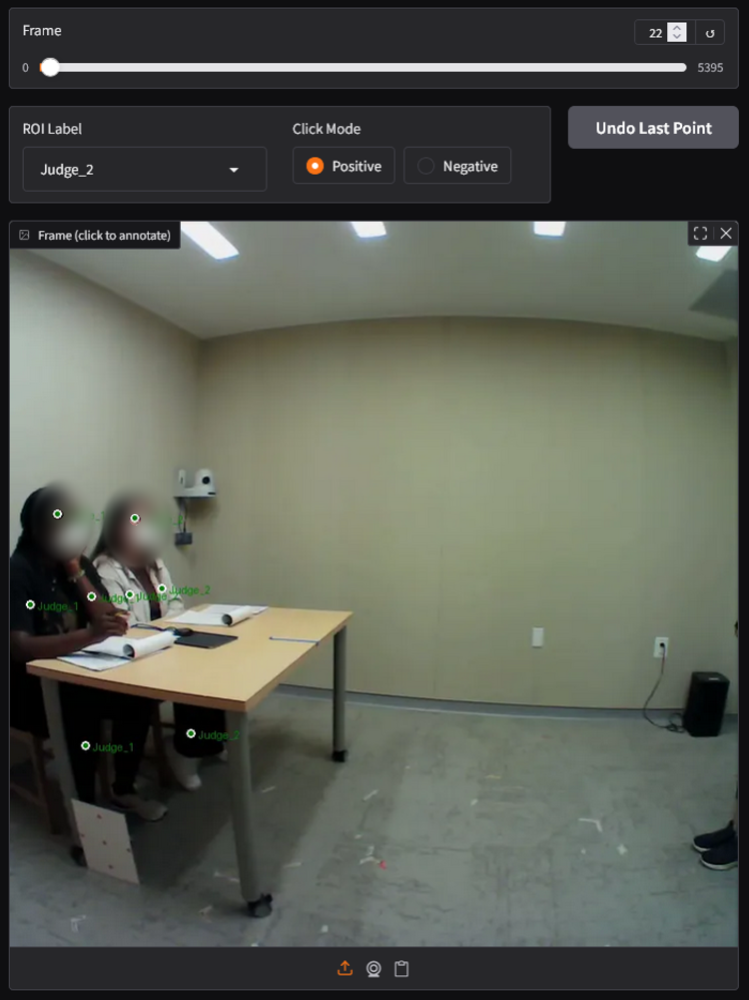
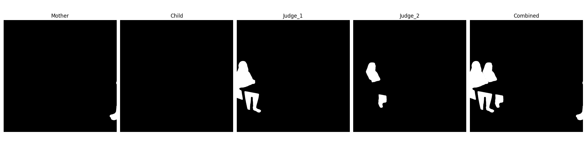
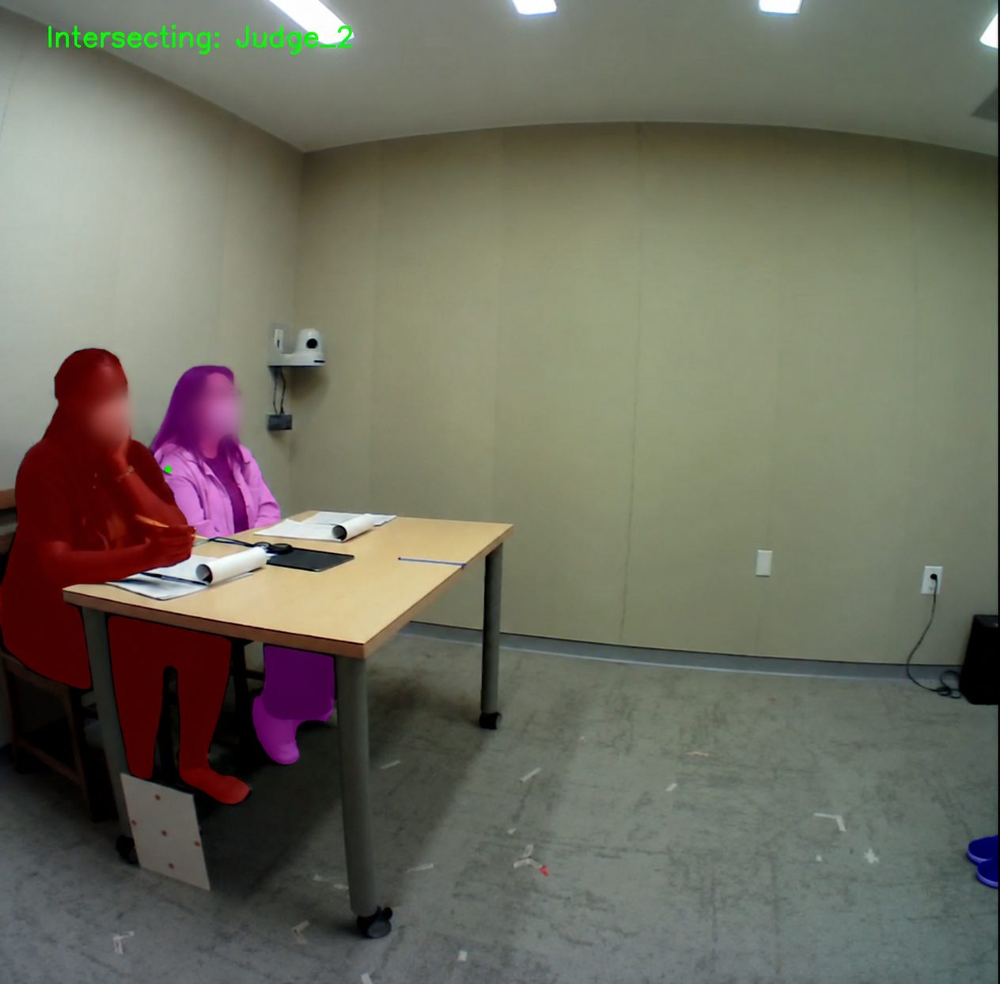
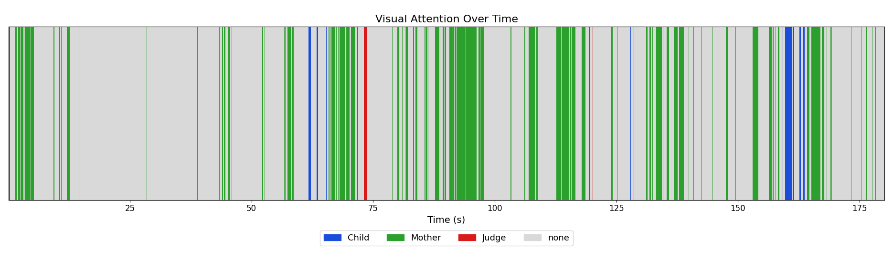

# METProcessing
### Mobile Eye-Tracking Processing with SAM 2
This pipeline is built to process eye-tracking videos obtained using Pupil Invisible eye-tracking glasses. It takes a POV video and corresponding gaze data as input, uses Meta's SAM2 model to segment and track areas of interest (AOIs), and outputs a fixations CSV that describes where the participant is looking throughout the video.

## Overview
The pipeline is divided into these steps:
1. **Extract frames**: extract frames from video using ffmpeg
2. **Create prompt**: use Gradio GUI to create prompts on AOIs for SAM2
3. **Segment**: run SAM2 inside Docker to segment ROIs and generate segmentation masks for each frame
4. **Map gaze data**: map gaze position data onto segmentation masks to produce visual fixation information

## Requirements
- Pupil Invisible eye-tracking video and gaze_positions.csv file
- Windows 10/11 with WSL2 enabled
- Python 3.10+
- ffmpeg
- Docker Desktop
- NVIDIA GPU and drivers

## Setup
All parameters for the pipeline need to be configured inside the `config.yaml` file or `batch_config.yaml` file, depending on whether the user is processing a few participant IDs manually or wants to process large-scale participant data automatically.

## 1. Extract Frames
ffmpeg is required to extract frames from the input video. You can download the compiled Windows build from https://ffmpeg.org/download.html and add it to the system path.
```bash
ffmpeg -i "path/to/video.mp4" -vf
"select=between(n\,START_FRAME\,END_FRAME),setpts=PTS-STARTPTS" -q:v 2 -start_number 0
path/to/frames/'%05d.jpg'
```
Use this ffmpeg command to extract frames from the POV video. The video should not have any visual overlays (like a gaze indicator dot) as this may interfere with segmentation results.
  
**Replace the following:**
- `path/to/video.mp4` with path to POV video from Pupil glasses
- `START_FRAME` and `END_FRAME` with the starting and ending frames for the time period you wish to process
- `path/to/frames` with the path to the output folder where the frames will be stored

## 2. Create prompt [`prompter_gradio.py`](sam2_pipeline/scripts/prompter_gradio.py)
AOIs must be annotated using the Gradio GUI which can be run using the following commands:  
`pip install gradio pillow pyyaml`  
`python prompter_gradio.py`  
The GUI will be accessible through your browser and will automatically load the frames folder specified in `config.yaml`. Use the slider to navigate through frames and click on AOIs to create prompts.
- Set the click mode to **Positive** for clicks inside the AOI and **Negative** for clicks outside the AOI
- Prompts can be placed across multiple frames for better tracking accuracy
- You will only have to annotate a few frames where the AOIs are clearly visible and SAM2 will track them throughout the rest of the video
- When finished, click **Save Coordinates** to export the prompt points to a JSON.


## 3. Segment [`segment_video.py`](sam2_pipeline/scripts/segment_video.py)
The segmentation script is run inside a Docker container.
### Option 1: Single Participant (Manual)
For processing one participant at a time with explicit Docker commands:

**Build the Docker image**  
This only needs to be done once.
```bash
docker build -t sam2 .
```

**Run segmentation**
```bash
docker run --gpus all --rm -v "C:\Users\user\sample_data:/data" -v "C:\Users\user\METPROCESSING\sam2_pipeline\config.yaml:/config/config.yaml" sam2
```

The `docker run` command starts the segmentation pipeline. Since the container is isolated from your machine, any files required while running need to be mounted beforehand using the `-v` flag, which maps a path on your machine to a path usable inside the container.

This pipeline requires two mounts:
- **Data folder**: containing the frames folder and `gaze_positions.csv`. This will be mapped to `/data` in the container
- **Config file**: the `config.yaml` file which will be mapped to `/config/config.yaml` inside the container.

Inside the command, the left side of the string (before the colon) **must** be changed to match the path of your data and config files.
<br>
The output of this step will be segmentation masks for each frame of the video. Here is an example of the segmentation masks for 1 frame:


---

### Option 2: Batch Processing
For processing multiple participant IDs in batches, including overnight unattended processing for large datasets:

1. **Configure the batch processor:**
   - Edit `batch_config.yaml` to specify:
     - Participant ID range (e.g., [510, 600]) or explicit list (e.g., [510, 514, 520])
     - Local and Docker data paths
     - Video source paths for FFmpeg extraction (must be named according to participant ID to use pattern-matching, e.g., `participant_510.mp4`)
     - Frame extraction and segmentation settings
     - GPU allocation and logging preferences

2. **Build the Docker image** (if not already built):
   ```bash
   docker build -t sam2 .
   ```

3. **Run the batch processor:**
   ```bash
   python batch_processor.py
   ```

4. **Monitor results:**
   - Console output shows real-time progress
   - Final summary table displays success/failure status for each participant
   - Full execution log saved to `batch_processing.log`

**Key features of batch processing:**
- **Fault tolerance**: If one participant fails, processing automatically continues to the next IDs instead of halting the entire batch
- **Memory safety**: Docker containers reset between participants, preventing Out of Memory (OOM) errors from affecting the runs 
- **Frame extraction**: Automated FFmpeg-based frame extraction from source videos to save time and reduce human error in manual frame handling
- **Dynamic configuration**: Per-participant configs generated automatically at runtime
- **Comprehensive reporting**: ASCII summary table showing which participants succeeded/failed with error details
- **Resumable workflows**: Failed participants can be re-run by editing batch_config.yaml

## 4. Map gaze data [`map_gaze_data.py`](sam2_pipeline/scripts/map_gaze_data.py)
The final step is to use the segmentation masks and gaze position information to determine visual fixations. Run the map gaze data script by calling:
`python map_gaze_data.py`  
This produces the following outputs in your output_dir:
- fixations.csv: fixation events with duration and timestamps (an example output can be found [here](assets/510_fixations.csv))
- fixations_expanded.csv: one row per frame with the AOI the person was looking at
- {id}_output.avi: video that displays segmentation masks and current fixation

